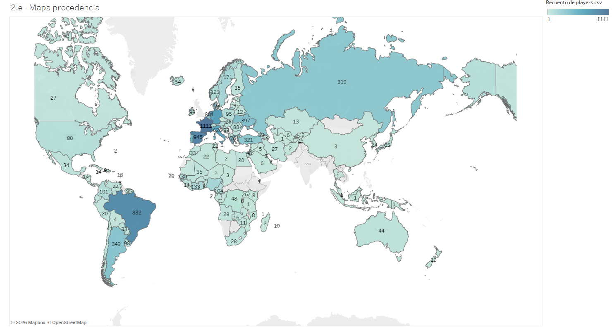
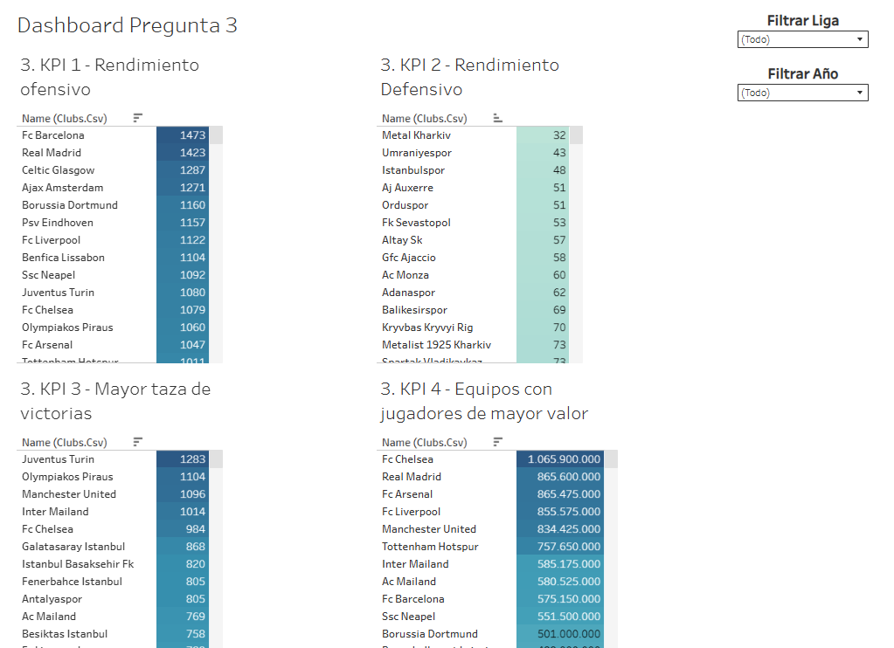
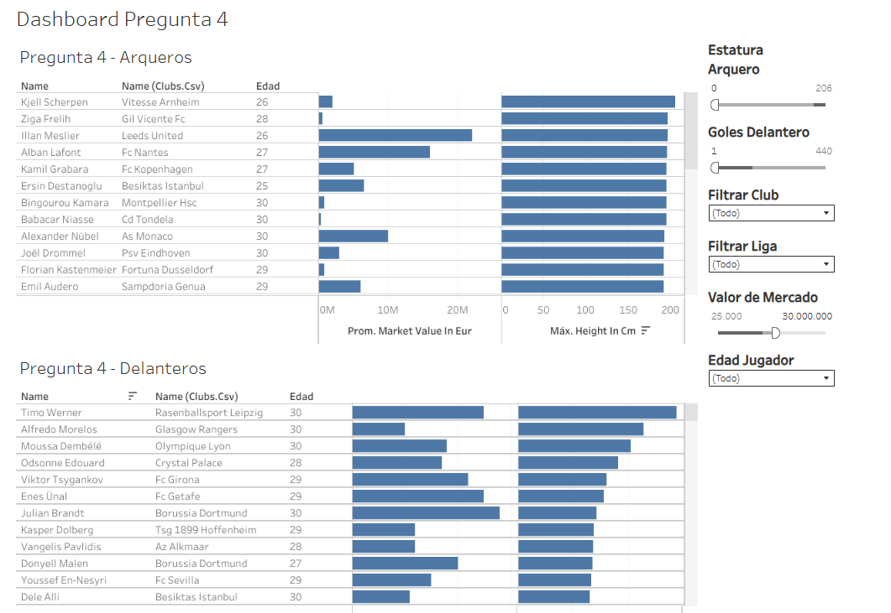

# Dashboard de Scouting Deportivo: Análisis de Fútbol

## Demo Interactiva
> **¡Haz clic en el botón de abajo para interactuar con el Dashboard en vivo!**
>
> 

---

## Vista Previa

## Descripción del Proyecto
Este proyecto simula un encargo real para la dirección técnica de un equipo de fútbol español. El objetivo fue desarrollar una herramienta de inteligencia deportiva para:
1.  **Analizar rivales** en la próxima Champions League.
2.  **Identificar talentos (Scouting)** para futuras contrataciones basándose en métricas de rendimiento y valor de mercado.

## Tecnologías y Técnicas
* **Tableau Public:** Diseño de interfaz y visualización.
* **Modelado de Datos:** Relacionamiento de múltiples fuentes (Jugadores, Clubes, Partidos, Eventos de Goles, Valuaciones).
* **Campos Calculados:** Creación de métricas personalizadas para evaluar el rendimiento.
* **UX/UI:** Diseño de filtros interactivos (por precio, liga, edad) para facilitar la toma de decisiones gerenciales.

## Insights
* El dashboard permite filtrar jugadores por **valor de mercado**, facilitando la búsqueda de "gangas" o estrellas consolidadas.
* Visualización geográfica y por ligas para entender la distribución del talento.
